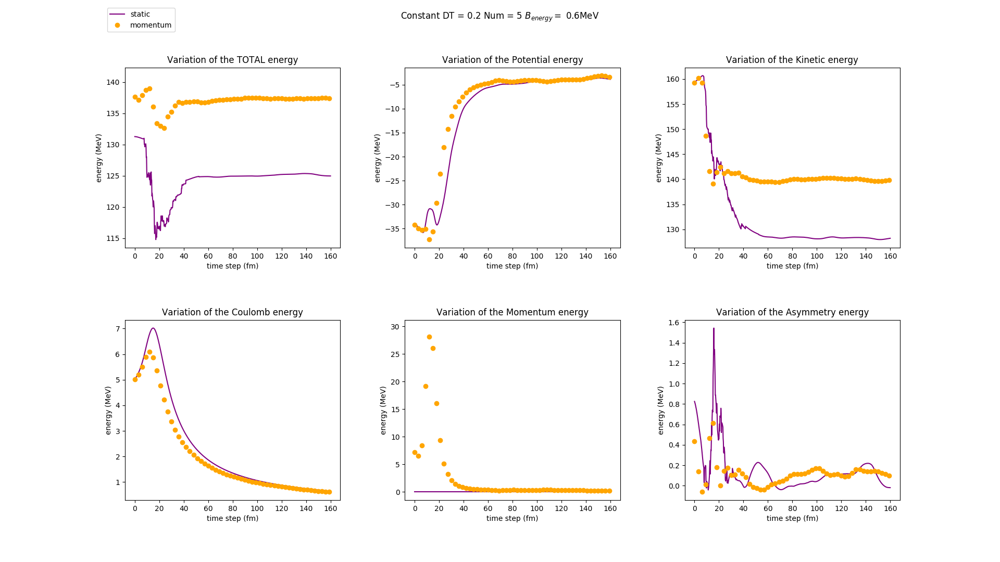

These functions and files are used to input the data created by the QMD part of PHQMD they mainly rely on the prop_out.dat files that are created by the main function and as such are already average when they are given to these funtions. They output so far the density contributions in graph form and will soon be able to output the density variation that will come with the addition of the asymmetry and the coulomb rectifications in the main functions.
### TO DO LIST
* [X] Change the graph_info vectors to make sure that they are static and momentum correctly for the legend that appears at the top of the figure

* [X] Add the density outputs, and make one generalised plotting file

* [X] Add the ability to turn off and on the output of the plots to .png 

* [X] Look into the possibility of outputting directly to pdf

* [X] Give better names to saved outputs

* [X] Look into the possibility of making the plotting_functions more compact and modular

* [ ] Fix the density output in the test_new class python and change the name of the former, add the run ability to the density and plot info class

### Current results
For the momentum it would appear that the energy is relatively stable with the exceptionn of the constant problem of the asymmetry energy that has yet to be resolved. As we can see in the following we have conservation for our static :
Furthermore we are now capable of tracking the position of the individual nucleons throughout the collision this can be done 
#### For large impact parameter `B=20`
Here we have conservation of our energies for the static : 

 The position of the nucleons can be plotted :
For static :

For momentum :

#### For small impact parameter `B=0.25`
Here we have conservation of our energies for the static : 

 The position of the nucleons can be plotted :
For static :

For momentum :

